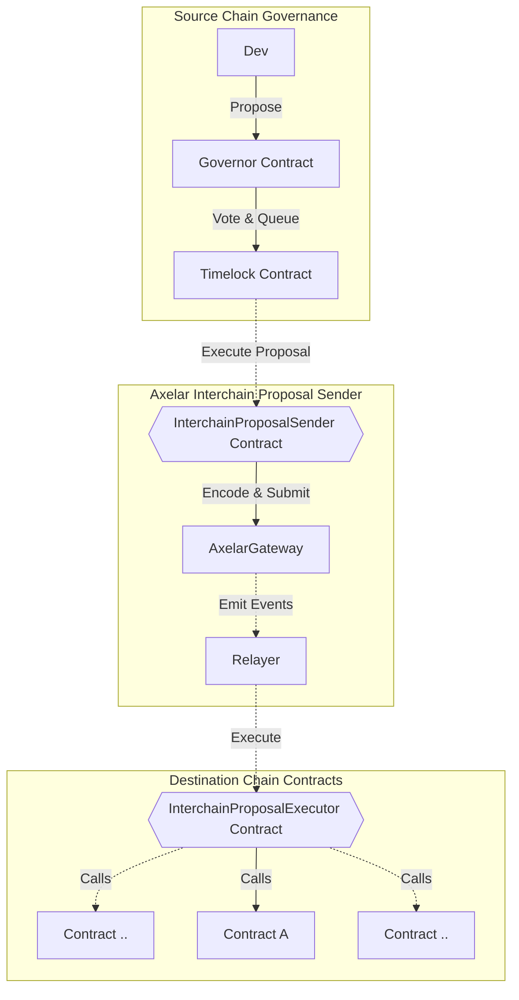

# Design

This doc covers the design of the Interchain governance and Interchain token service contracts.

# Governance

### Interchain Governance

The Interchain Governance Contract facilitates cross-chain governance actions within the Axelar network. It enables the creation, cancellation, and execution of governance proposals while incorporating a TimeLock mechanism. The TimeLock mechanism institutes a mandatory time delay before any proposal execution, thereby offering robust protection against sudden, potentially disruptive changes. This mechanism is used to govern upgrades of the Axelar Gateway contract.

#### Timelock Mechanism

The TimeLock contract institutes a mechanism that guarantees the secure execution of functions after a designated time delay. This mechanism not only enables the scheduling, cancellation, and finalization of function calls, but it also enforces a minimum time delay before any function can be either scheduled or finalized, thereby enhancing the contract's security.

#### Governance Operations

The TimeLock contract manages two types of governance operations: Proposal Scheduling and Proposal Cancellation.

-   **Proposal Scheduling**: Facilitates the creation of new proposals. For each scheduled proposal, it sets a corresponding TimeLock that must expire before the proposal's execution.

-   **Proposal Cancellation**: Facilitates the cancellation of an existing proposal by setting its corresponding TimeLock timestamp to zero and thereby blocking its execution.

Both operations require a match between the source chain and source address, and the governance chain and governance address in the contract. This check guarantees that only authorized entities can schedule or cancel actions.

#### Secure Execution of Proposals

Once their corresponding TimeLock expires, proposals become executable. For ensured safety during execution, the contract revalidates the TimeLock right before initiating the proposal execution.

#### Generating Proposal Hashes

The system ensures the uniqueness of each proposal by generating hashes with the Keccak256 algorithm. The hashes are derived from the target contract's address, encoded function call data, and the native token transfer value.

### Multisig

The Multisig contract maintains a list of signer accounts and enforces a threshold or minimum number of signers required to execute certain functions. It plays a pivotal role in defining token mint limits for the gateway.

#### Voting Procedure

For each transaction, a voting process is initiated among the signers. Every time a signer casts a vote, the counter increases, and the action is recorded under the signer's address. Once the threshold is met, the transaction is carried out, and the voting counter is reset.

#### Rotation of Signers

The Multisig contract facilitates a rotation mechanism for signers. Existing signers can refresh the list of signatory addresses and the threshold value using the `rotateSigners` function. Each rotation is tracked by incrementing an epoch.

#### Execution of External Contracts

The Multisig contract's `execute` function allows signers to call any function on any external contract if the threshold number of signers trigger the method with the same args.

#### Safeguards

The Multisig contract incorporates safeguards to deter misuse. These safeguards enforce preventive measures such as prohibiting multiple votes from the same account within an epoch, preventing signer duplication, and requiring transactions to meet the voting threshold before execution.

#### Multisig Operations

Multisig operations demand multi-signatory authorization for proposal execution. A mapping mechanism tracks approvals for different proposals, requiring a proposal to garner sufficient approval to meet the predefined threshold before its execution.

### Axelar Service Governance

Building upon the Interchain Governance Contract, the Service Governance Contract is specifically designed to manage operations that require coordination. By incorporating `MultisigBase`, it introduces the functionality to approve, execute, and cancel multisig proposals, in addition to schedule and cancel TimeLock proposals. This is intended to be used as the owner for services such as the Interchain token service contract, allowing Axelar governance to manage it.

#### Service Governance Operations

The contract orchestrates four governance operations:

-   **Schedule TimeLock Proposal**: Similar to Interchain Governance, it schedules a new governance proposal with a TimeLock.

-   **Cancel TimeLock Proposal**: Again, similar to Interchain Governance, it cancels an existing governance proposal.

-   **Approve Multisig Proposal**: Enables multisig proposal approval, setting the approval status of the proposal to true and signaling successful approval via a `MultisigApproved` event.

-   **Cancel Multisig Approval**: Cancels an approved multisig proposal, setting the approval status of the proposal to false and indicating successful cancellation through a `MultisigCancelled` event.

#### Secure Execution of Multisig Proposals

Upon receiving the necessary number of signatory approvals, a multisig proposal becomes eligible for execution. Before execution, the contract verifies the proposal's approval status; if the approval status is false, the transaction is reverted. Following successful execution, the proposal's approval status is reset, and a `MultisigExecuted` event is emitted.

# Axelar Interchain Governance Executor

Axelar Interchain Governance Executor is a project that enhances on-chain governance protocols to facilitate interchain proposal execution. We demonstrate the extension using Compound's governance contracts, but the approach can be applied to any governance protocol.

## Key Components

There are two essential contracts in this interchain extension:

1. `InterchainProposalSender`: Deployed on the source chain, this contract has a method called `sendProposal`. This method encodes a proposal into a payload for a remote chain and pays the Axelar Gas Service for the execution of the interchain call on the destination chain.

2. `InterchainProposalExecutor`: Deployed on the destination chain, this contract has a callback method `_execute` that executes the proposal on the target contracts.

For a visual transaction flow of the interchain proposal, see the mermaid diagram below.

# Interchain Token Service

## Introduction

This project aims to provide a platform that enables tokens of all kinds to go cross-chain. To achieve this we need a cross-chain communication protocol, that can reliably pass information through chains. The Axelar Network is used for this design, but it is possible to adjust some of the contracts to use a different network.

For the purposes of this document we will use two keywords: deployer, the person who creates the bridge and user, the person using a bridge.

## Architecture

The main workflow of a bridge is the following:

-   Obtains `x` token from the user on chain A
-   Send a message to chain B indicating that this happened, and where the token should go to
-   Receive the above message, and hand `x` token to the appropriate address

For this to be a proper bridge it should be possible to perform the above steps for any supported chain being 'chain A' and 'chain B'. There are multiple different possible configurations for any bridge, and we wanted to make it as easy as possible for deployers to get what they want, while making it cheap and easy for users to get their tokens across chains as well.

The workflow described below is facilitated by 2 smart contracts the [`InterchainTokenService`](https://github.com/code-423n4/2023-07-axelar/blob/main/contracts/its/interchain-token-service/InterchainTokenService.sol) and the [`TokenManager`](https://github.com/code-423n4/2023-07-axelar/blob/main/contracts/its/token-manager/TokenManager.sol). The `TokenManager` handles tokens and is the input side for all requests, and the `InterchainTokenService` deploys `TokenManagers` and is responsible for sending and receiving messages. Each bridge will result in a new `TokenManager` with a unique `tokenId`. There are a few different options that deployers have to obtain different kinds of `TokenManagers` with different guarantees and flexibility.

Note that a lot of the design choises were made with supporting non-EVM chains in mind.

### Canonical Bridges

Most current bridge designs aim to get a pre-existing, popular token to different chains that can benefit from the liquidity. When they do so the resulting token, called [`StandardizedToken`](https://github.com/code-423n4/2023-07-axelar/blob/main/contracts/its/token-implementations/StandardizedToken.sol) in this project, will only have basic functionality that enables users to transfer their token and use it with general use smart contracts like De-Fi applications. This is certainly powerfull, and has the benefit that as long as the pre-existing `ERC20` implemention and the bridge function properly everything run as expected. We wanted to include this design for the `InterchainTokenService` as well, so deployers can deploy a Canonical Bridge for any token they want, and this can be done only once per pre-existing `ERC20`. Who the deployer is does not matter for this, they just need to pay for the deployment gas, but they do not need to be trusted as they have no special powers over this kind of bridge

### Custom Bridges

Most projects that look to go cross-chain nowadays have more complex needs that the ones covered by Canonical Bridges: they often need custom `ERC20` designs, and will sometimes want to have additional power over the bridge. This is where the `InterchainTokenService` shines, deployers can claim certain `tokenIds` only based on their `address`, and a `salt` they provide, and specify any kind of `TokenManager` to be deployed and either manage an external `ERC20` or a `StandardizedToken`. Users using Custom Bridges need to trust the deployers as they could easily confiscate the funds of users if they wanted to, same as any `ERC20` distributor could confiscate the funds of users. There are currently three kinds of possible `TokenManagers` available, but this number might increase in the future, as we find more potential uses for the `InterchainTokenService`.

-   Lock/Unlock: This `TokenManager` will simply transfer tokens from a user to itself or vice versa to initiate/fulfill cross-chain transfers
-   Mint/Burn: This `TokenManager` will burn/mint tokens from/to the user to initiate/fulfill cross-chain transfers. Tokens used with this kind of `TokenManager` need to be properly permissioned to allow for this behaviour.
-   Liquidity Pool: This `TokenManager` functions exaclty like a Lock/Unlock one, except the balance is kept at a separate, prespecified account. This allows for deployers to have more controll over the bridged funds.

## Linker Router

We plan to finalize the design of the `InterchainTokenService` but we want to be able to support new chains as they get added to the Axelar Network. For this purpose, the service will ask a separate contract, the [`RemoteAddressValidator`](https://github.com/code-423n4/2023-07-axelar/blob/main/contracts/its/remote-address-validator/RemoteAddressValidator.sol) to obtain the destination address for outgoing messages, and for validation of incoming messages. This contract might eventually stop being upgradable but it will probalby be able to support new addresses for new chains indefinately.

## Interchain Token

We designed an [interface](./contracts/interfaces/IInterchainToken.sol) allong a [example implementation](https://github.com/code-423n4/2023-07-axelar/blob/main/contracts/its/interchain-token/InterchainToken.sol) of an ERC20 that can use the `InterchainTokenService` internally. This has the main benefit that for `TokenManagers` that require user approval (Lock/Unlock and Liquidity Pool typically) the token can provide this approval within the same call, providing better UX for users, and saving them some gas.
