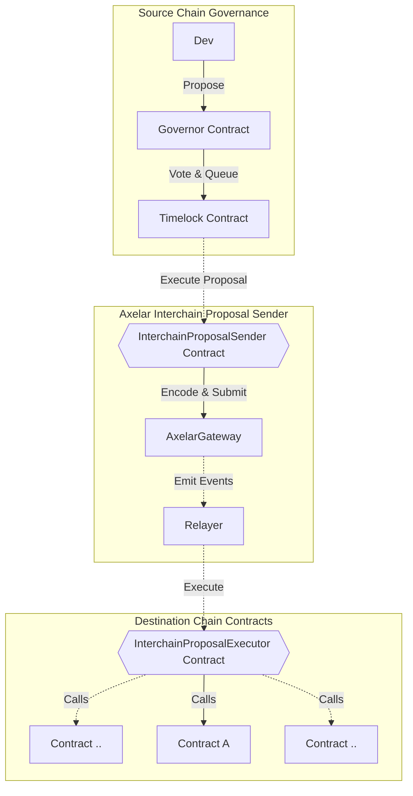

# ✨ So you want to run an audit

This `README.md` contains a set of checklists for our audit collaboration.

Your audit will use two repos:

-   **an _audit_ repo** (this one), which is used for scoping your audit and for providing information to wardens
-   **a _findings_ repo**, where issues are submitted (shared with you after the audit)

Ultimately, when we launch the audit, this repo will be made public and will contain the smart contracts to be reviewed and all the information needed for audit participants. The findings repo will be made public after the audit report is published and your team has mitigated the identified issues.

Some of the checklists in this doc are for **C4 (🐺)** and some of them are for **you as the audit sponsor (⭐️)**.

---

# Repo setup

## ⭐️ Sponsor: Add code to this repo

-   [ ] Create a PR to this repo with the below changes:
-   [ ] Provide a self-contained repository with working commands that will build (at least) all in-scope contracts, and commands that will run tests producing gas reports for the relevant contracts.
-   [ ] Make sure your code is thoroughly commented using the [NatSpec format](https://docs.soliditylang.org/en/v0.5.10/natspec-format.html#natspec-format).
-   [ ] Please have final versions of contracts and documentation added/updated in this repo **no less than 24 hours prior to audit start time.**
-   [ ] Be prepared for a 🚨code freeze🚨 for the duration of the audit — important because it establishes a level playing field. We want to ensure everyone's looking at the same code, no matter when they look during the audit. (Note: this includes your own repo, since a PR can leak alpha to our wardens!)

---

## ⭐️ Sponsor: Edit this README

Under "SPONSORS ADD INFO HERE" heading below, include the following:

-   [ ] Modify the bottom of this `README.md` file to describe how your code is supposed to work with links to any relevent documentation and any other criteria/details that the C4 Wardens should keep in mind when reviewing. ([Here's a well-constructed example.](https://github.com/code-423n4/2022-08-foundation#readme))
    -   [ ] When linking, please provide all links as full absolute links versus relative links
    -   [ ] All information should be provided in markdown format (HTML does not render on Code4rena.com)
-   [ ] Under the "Scope" heading, provide the name of each contract and:
    -   [ ] source lines of code (excluding blank lines and comments) in each
    -   [ ] external contracts called in each
    -   [ ] libraries used in each
-   [ ] Describe any novel or unique curve logic or mathematical models implemented in the contracts
-   [ ] Does the token conform to the ERC-20 standard? In what specific ways does it differ?
-   [ ] Describe anything else that adds any special logic that makes your approach unique
-   [ ] Identify any areas of specific concern in reviewing the code
-   [ ] Review the Gas award pool amount. This can be adjusted up or down, based on your preference - just flag it for Code4rena staff so we can update the pool totals across all comms channels.
-   [ ] Optional / nice to have: pre-record a high-level overview of your protocol (not just specific smart contract functions). This saves wardens a lot of time wading through documentation.
-   [ ] See also: [this checklist in Notion](https://code4rena.notion.site/Key-info-for-Code4rena-sponsors-f60764c4c4574bbf8e7a6dbd72cc49b4#0cafa01e6201462e9f78677a39e09746)
-   [ ] Delete this checklist and all text above the line below when you're ready.

---

# Axelar Network audit details

-   Total Prize Pool: $80,000 USDC
    -   HM awards: $54,662 USDC
    -   Analysis awards: $3,312 USDC
    -   QA awards: $1,655 USDC
    -   Bot Race awards: $4,966 USDC
    -   Gas awards: $1,655 USDC
    -   Judge awards: $8,000 USDC
    -   Lookout awards: $5,250 USDC
    -   Scout awards: $500 USDC
-   Join [C4 Discord](https://discord.gg/code4rena) to register
-   Submit findings [using the C4 form](https://code4rena.com/contests/2023-07-axelar/submit)
-   [Read our guidelines for more details](https://docs.code4rena.com/roles/wardens)
-   Starts July 07, 2023 20:00 UTC
-   Ends July 17, 2023 20:00 UTC

## Automated Findings / Publicly Known Issues

Automated findings output for the audit can be found [here](add link to report) within 24 hours of audit opening.

_Note for C4 wardens: Anything included in the automated findings output is considered a publicly known issue and is ineligible for awards._

[ ⭐️ SPONSORS ADD INFO HERE ]

# Overview

## Axelar Governance

### Interchain Governance

The Interchain Governance Contract facilitates cross-chain governance actions within the Axelar network. It enables the creation, cancellation, and execution of governance proposals while incorporating a TimeLock mechanism. The TimeLock mechanism institutes a mandatory time delay before any proposal execution, thereby offering robust protection against sudden, potentially disruptive changes. This mechanism is used to govern upgrades of the Axelar Gateway contract.

#### Timelock Mechanism

The TimeLock contract institutes a mechanism that guarantees the secure execution of functions after a designated time delay. This mechanism not only enables the scheduling, cancellation, and finalization of function calls, but it also enforces a minimum time delay before any function can be either scheduled or finalized, thereby enhancing the contract's security.

#### Governance Operations

The TimeLock contract manages two types of governance operations: Proposal Scheduling and Proposal Cancellation.

-   **Proposal Scheduling**: Facilitates the creation of new proposals. For each scheduled proposal, it sets a corresponding TimeLock that must expire before the proposal's execution.

-   **Proposal Cancellation**: Facilitates the cancellation of an existing proposal by setting its corresponding TimeLock timestamp to zero and thereby blocking its execution.

Both operations require a match between the source chain and source address, and the governance chain and governance address in the contract. This check guarantees that only authorized entities can schedule or cancel actions.

#### Secure Execution of Proposals

Once their corresponding TimeLock expires, proposals become executable. For ensured safety during execution, the contract revalidates the TimeLock right before initiating the proposal execution.

#### Generating Proposal Hashes

The system ensures the uniqueness of each proposal by generating hashes with the Keccak256 algorithm. The hashes are derived from the target contract's address, encoded function call data, and the native token transfer value.

### Multisig

The Multisig contract maintains a list of signer accounts and enforces a threshold or minimum number of signers required to execute certain functions. It plays a pivotal role in defining token mint limits for the gateway.

#### Voting Procedure

For each transaction, a voting process is initiated among the signers. Every time a signer casts a vote, the counter increases, and the action is recorded under the signer's address. Once the threshold is met, the transaction is carried out, and the voting counter is reset.

#### Rotation of Signers

The Multisig contract facilitates a rotation mechanism for signers. Existing signers can refresh the list of signatory addresses and the threshold value using the `rotateSigners` function. Each rotation is tracked by incrementing an epoch.

#### Execution of External Contracts

The Multisig contract's `execute` function allows signers to call any function on any external contract if the threshold number of signers trigger the method with the same args.

#### Safeguards

The Multisig contract incorporates safeguards to deter misuse. These safeguards enforce preventive measures such as prohibiting multiple votes from the same account within an epoch, preventing signer duplication, and requiring transactions to meet the voting threshold before execution.

#### Multisig Operations

Multisig operations demand multi-signatory authorization for proposal execution. A mapping mechanism tracks approvals for different proposals, requiring a proposal to garner sufficient approval to meet the predefined threshold before its execution.

### Axelar Service Governance

Building upon the Interchain Governance Contract, the Service Governance Contract is specifically designed to manage operations that require coordination. By incorporating `MultisigBase`, it introduces the functionality to approve, execute, and cancel multisig proposals, in addition to schedule and cancel TimeLock proposals. This is intended to be used as the owner for services such as the Interchain token service contract, allowing Axelar governance to manage it.

#### Service Governance Operations

The contract orchestrates four governance operations:

-   **Schedule TimeLock Proposal**: Similar to Interchain Governance, it schedules a new governance proposal with a TimeLock.

-   **Cancel TimeLock Proposal**: Again, similar to Interchain Governance, it cancels an existing governance proposal.

-   **Approve Multisig Proposal**: Enables multisig proposal approval, setting the approval status of the proposal to true and signaling successful approval via a `MultisigApproved` event.

-   **Cancel Multisig Approval**: Cancels an approved multisig proposal, setting the approval status of the proposal to false and indicating successful cancellation through a `MultisigCancelled` event.

#### Secure Execution of Multisig Proposals

Upon receiving the necessary number of signatory approvals, a multisig proposal becomes eligible for execution. Before execution, the contract verifies the proposal's approval status; if the approval status is false, the transaction is reverted. Following successful execution, the proposal's approval status is reset, and a `MultisigExecuted` event is emitted.

# Axelar Interchain Governance Executor

Axelar Interchain Governance Executor is a project that enhances on-chain governance protocols to facilitate interchain proposal execution. We demonstrate the extension using Compound's governance contracts, but the approach can be applied to any governance protocol.

## Key Components

There are two essential contracts in this interchain extension:

1. `InterchainProposalSender`: Deployed on the source chain, this contract has a method called `sendProposal`. This method encodes a proposal into a payload for a remote chain and pays the Axelar Gas Service for the execution of the interchain call on the destination chain.

2. `InterchainProposalExecutor`: Deployed on the destination chain, this contract has a callback method `_execute` that executes the proposal on the target contracts.

For a visual transaction flow of the interchain proposal, see the mermaid diagram below.



# Interchain Token Service Design Notes

## Introduction

This project aims to provide a platform that enables tokens of all kinds to go cross-chain. To achieve this we need a cross-chain communication protocol, that can reliably pass information through chains. The Axelar Network is used for this design, but it is possible to adjust some of the contracts to use a different network.

For the purposes of this document we will use two keywords: deployer, the person who creates the bridge and user, the person using a bridge.

## Architecture

The main workflow of a bridge is the following:

-   Obtains `x` token from the user on chain A
-   Send a message to chain B indicating that this happened, and where the token should go to
-   Receive the above message, and hand `x` token to the appropriate address

For this to be a proper bridge it should be possible to perform the above steps for any supported chain being 'chain A' and 'chain B'. There are multiple different possible configurations for any bridge, and we wanted to make it as easy as possible for deployers to get what they want, while making it cheap and easy for users to get their tokens across chains as well.

The workflow described below is facilitated by 2 smart contracts the [`InterchainTokenService`](./contracts/interchainTokenService/InterchainTokenService.sol) and the [`TokenManager`](./contracts/tokenManager/TokenManager.sol). The `TokenManager` handles tokens and is the input side for all requests, and the `InterchainTokenService` deploys `TokenManagers` and is responsible for sending and receiving messages. Each bridge will result in a new `TokenManager` with a unique `tokenId`. There are a few different options that deployers have to obtain different kinds of `TokenManagers` with different guarantees and flexibility.

Note that a lot of the design choises were made with supporting non-EVM chains in mind.

### Canonical Bridges

Most current bridge designs aim to get a pre-existing, popular token to different chains that can benefit from the liquidity. When they do so the resulting token, called [`StandardizedToken`](./contracts/utils/StandardizedToken.sol) in this project, will only have basic functionality that enables users to transfer their token and use it with general use smart contracts like De-Fi applications. This is certainly powerfull, and has the benefit that as long as the pre-existing `ERC20` implemention and the bridge function properly everything run as expected. We wanted to include this design for the `InterchainTokenService` as well, so deployers can deploy a Canonical Bridge for any token they want, and this can be done only once per pre-existing `ERC20`. Who the deployer is does not matter for this, they just need to pay for the deployment gas, but they do not need to be trusted as they have no special powers over this kind of bridge

### Custom Bridges

Most projects that look to go cross-chain nowadays have more complex needs that the ones covered by Canonical Bridges: they often need custom `ERC20` designs, and will sometimes want to have additional power over the bridge. This is where the `InterchainTokenService` shines, deployers can claim certain `tokenIds` only based on their `address`, and a `salt` they provide, and specify any kind of `TokenManager` to be deployed and either manage an external `ERC20` or a `StandardizedToken`. Users using Custom Bridges need to trust the deployers as they could easily confiscate the funds of users if they wanted to, same as any `ERC20` distributor could confiscate the funds of users. There are currently three kinds of possible `TokenManagers` available, but this number might increase in the future, as we find more potential uses for the `InterchainTokenService`.

-   Lock/Unlock: This `TokenManager` will simply transfer tokens from a user to itself or vice versa to initiate/fulfill cross-chain transfers
-   Mint/Burn: This `TokenManager` will burn/mint tokens from/to the user to initiate/fulfill cross-chain transfers. Tokens used with this kind of `TokenManager` need to be properly permissioned to allow for this behaviour.
-   Liquidity Pool: This `TokenManager` functions exaclty like a Lock/Unlock one, except the balance is kept at a separate, prespecified account. This allows for deployers to have more controll over the bridged funds.

## Linker Router

We plan to finalize the design of the `InterchainTokenService` but we want to be able to support new chains as they get added to the Axelar Network. For this purpose, the service will ask a separate contract, the [`RemoteAddressValidator`](./contracts/remoteAddressValidator/RemoteAddressValidator.sol) to obtain the destination address for outgoing messages, and for validation of incoming messages. This contract might eventually stop being upgradable but it will probalby be able to support new addresses for new chains indefinately.

## Interchain Token

We designed an [interface](./contracts/interfaces/IInterchainToken.sol) allong a [example implementation](./contracts/interchainToken/InterchainToken.sol) of an ERC20 that can use the `InterchainTokenService` internally. This has the main benefit that for `TokenManagers` that require user approval (Lock/Unlock and Liquidity Pool typically) the token can provide this approval within the same call, providing better UX for users, and saving them some gas.

# Scope

| Contract                                                                                                               | SLOC | Purpose                                                                                                                                                                                                                                                                                                                                           | Libraries used                                                                                                                                                                                          |
| ---------------------------------------------------------------------------------------------------------------------- | ---- | ------------------------------------------------------------------------------------------------------------------------------------------------------------------------------------------------------------------------------------------------------------------------------------------------------------------------------------------------- | ------------------------------------------------------------------------------------------------------------------------------------------------------------------------------------------------------- |
| [AxelarGateway.sol](contracts/cgp/AxelarGateway.sol)                                                                   | 70   | Updated implementation of AxelarGateway with governance and mint limiter integration. NOTE: only upgrade, setup, and onlyGovernance/onlyMintLimiter modified functions are within scope.                                                                                                                                                          | N/A                                                                                                                                                                                                     |
| [IMultisigBase.sol](contracts/cgp/interfaces/IMultisigBase.sol)                                                        | 56   | An interface defining the base operations for a multisignature contract.                                                                                                                                                                                                                                                                          | N/A                                                                                                                                                                                                     |
| [MultisigBase.sol](contracts/cgp/auth/MultisigBase.sol)                                                                | 148  | This contract implements a custom multisignature wallet where transactions must be confirmed by a threshold of signers. The signers and threshold may be updated every `epoch`.                                                                                                                                                                   | N/A                                                                                                                                                                                                     |
| [IMultisigBase.sol](contracts/cgp/interfaces/IMultisigBase.sol)                                                        | 56   | An interface defining the base operations for a multisignature contract.                                                                                                                                                                                                                                                                          | N/A                                                                                                                                                                                                     |
| [AxelarServiceGovernance.sol](contracts/cgp/governance/AxelarServiceGovernance.sol)                                    | 108  | This contract is part of the Axelar Governance system, it inherits the Interchain Governance contract with added functionality to approve and execute multisig proposals.                                                                                                                                                                         | N/A                                                                                                                                                                                                     |
| [IAxelarServiceGovernance.sol](contracts/cgp/interfaces/IAxelarServiceGovernance.sol)                                  | 29   | This interface extends IInterchainGovernance and IMultisigBase for multisig proposal actions.                                                                                                                                                                                                                                                     | N/A                                                                                                                                                                                                     |
| [InterchainGovernance.sol](contracts/cgp/governance/InterchainGovernance.sol)                                          | 148  | This contract handles cross-chain governance actions. It includes functionality to create, cancel, and execute governance proposals.                                                                                                                                                                                                              | N/A                                                                                                                                                                                                     |
| [IInterchainGovernance.sol](contracts/cgp/interfaces/IInterchainGovernance.sol)                                        | 70   | This interface extends IAxelarExecutable for interchain governance mechanisms.                                                                                                                                                                                                                                                                    | N/A                                                                                                                                                                                                     |
| [Multisig.sol](contracts/cgp/governance/Multisig.sol)                                                                  | 42   | An extension of MultisigBase that can call functions on any contract.                                                                                                                                                                                                                                                                             | N/A                                                                                                                                                                                                     |
| [IMultisig.sol](contracts/cgp/interfaces/IMultisig.sol)                                                                | 24   | This interface extends IMultisigBase by adding an execute function for multisignature transactions.                                                                                                                                                                                                                                               | N/A                                                                                                                                                                                                     |
| [TimeLock.sol](contracts/gmp-sdk/util/TimeLock.sol)                                                                    | 110  | A contract that enables function execution after a certain time has passed. Implements the ITimeLock interface.                                                                                                                                                                                                                                   | N/A                                                                                                                                                                                                     |
| [ITimeLock.sol](contracts/gmp-sdk/interfaces/ITimeLock.sol)                                                            | 26   | Interface for a TimeLock that enables function execution after a certain time has passed.                                                                                                                                                                                                                                                         | N/A                                                                                                                                                                                                     |
| [Caller.sol](contracts/cgp/util/Caller.sol)                                                                            | 23   | A contract to call a target address with specified calldata and optionally send value.                                                                                                                                                                                                                                                            | N/A                                                                                                                                                                                                     |
| [ICaller.sol](contracts/cgp/interfaces/ICaller.sol)                                                                    | 8    | Interface for Caller.sol.                                                                                                                                                                                                                                                                                                                         | N/A                                                                                                                                                                                                     |
| [Create3.sol](contracts/gmp-sdk/deploy/Create3.sol)                                                                    | 76   | This file contains the CreateDeployer contract which deploys new contracts using the `CREATE` opcode and is used as part of the `Create3` deployment method. This file also contains the Create3 library which can be used to deploy a contract with a deterministic address that only depends on the sender and salt, not the contract bytecode. | [ContractAddress.sol](contracts/gmp-sdk/util/ContractAddress.sol)                                                                                                                                       |
| [Create3Deployer.sol](contracts/gmp-sdk/deploy/Create3Deployer.sol)                                                    | 71   | This contract is responsible for deploying and initializing new contracts using the CREATE3 technique which ensures that only the sender address and salt influence the deployed address, not the contract bytecode.                                                                                                                              | [Create3.sol](contracts/gmp-sdk/util/Create3.sol)                                                                                                                                                       |
| [BaseProxy.sol](contracts/gmp-sdk/upgradable/BaseProxy.sol)                                                            | 69   | This abstract contract implements a basic proxy that stores an implementation address. Fallback function calls are delegated to the implementation.                                                                                                                                                                                               | N/A                                                                                                                                                                                                     |
| [FinalProxy.sol](contracts/gmp-sdk/upgradable/FinalProxy.sol)                                                          | 90   | The FinalProxy contract is a proxy that can be upgraded to a final implementation that uses less gas than regular proxy calls.                                                                                                                                                                                                                    | N/A                                                                                                                                                                                                     |
| [IFinalProxy.sol](contracts/gmp-sdk/interfaces/IFinalProxy.sol)                                                        | 12   | Interface for the FinalProxy contract.                                                                                                                                                                                                                                                                                                            | N/A                                                                                                                                                                                                     |
| [FixedProxy.sol](contracts/gmp-sdk/upgradable/FixedProxy.sol)                                                          | 60   | The FixedProxy is a type of Proxy contract with a fixed implementation that cannot be updated.                                                                                                                                                                                                                                                    | N/A                                                                                                                                                                                                     |
| [InitProxy.sol](contracts/gmp-sdk/upgradable/InitProxy.sol)                                                            | 64   | A proxy contract that can be initialized to use a specified implementation and owner.                                                                                                                                                                                                                                                             | N/A                                                                                                                                                                                                     |
| [IInitProxy.sol](contracts/gmp-sdk/interfaces/IInitProxy.sol)                                                          | 14   | Interface for the InitProxy contract.                                                                                                                                                                                                                                                                                                             | N/A                                                                                                                                                                                                     |
| [Proxy.sol](contracts/gmp-sdk/upgradable/Proxy.sol)                                                                    | 45   | A proxy contract that delegates calls to a designated implementation contract.                                                                                                                                                                                                                                                                    | N/A                                                                                                                                                                                                     |
| [IProxy.sol](contracts/gmp-sdk/interfaces/IProxy.sol)                                                                  | 16   | Interface for the Proxy contract.                                                                                                                                                                                                                                                                                                                 | N/A                                                                                                                                                                                                     |
| [Upgradable.sol](contracts/gmp-sdk/upgradable/Upgradable.sol)                                                          | 88   | This contract provides an interface for upgradable smart contracts and includes the functionality to perform upgrades.                                                                                                                                                                                                                            | N/A                                                                                                                                                                                                     |
| [IUpgradable.sol](contracts/gmp-sdk/interfaces/IUpgradable.sol)                                                        | 27   | Interface for the Upgradable contract.                                                                                                                                                                                                                                                                                                            | N/A                                                                                                                                                                                                     |
| [InterchainToken.sol](contracts/its/interchain-token/InterchainToken.sol)                                              | 106  | An example implementation of the IInterchainToken.                                                                                                                                                                                                                                                                                                | N/A                                                                                                                                                                                                     |
| [IInterchainToken.sol](contracts/its/interfaces/IInterchainToken.sol)                                                  | 44   | Interface for InterchainToken.                                                                                                                                                                                                                                                                                                                    | N/A                                                                                                                                                                                                     |
| [InterchainTokenService.sol](contracts/its/interchain-token-service/InterchainTokenService.sol)                        | 870  | This contract is responsible for facilitating cross chain token transfers.                                                                                                                                                                                                                                                                        | [StringToBytes32](contracts/gmp-sdk/util/Bytes32ToString.sol) [Bytes32ToString](contracts/gmp-sdk/util/Bytes32ToString.sol) [AddressBytesUtils](contracts/its/libraries/AddressBytesUtils.sol)          |
| [AddressBytesUtils.sol](contracts/its/libraries/AddressBytesUtils.sol)                                                 | 38   | This library provides utility functions to convert between `address` and `bytes`.                                                                                                                                                                                                                                                                 | N/A                                                                                                                                                                                                     |
| [IInterchainTokenService.sol](contracts/its/interfaces/IInterchainTokenService.sol)                                    | 339  | Interface for InterchainTokenService.                                                                                                                                                                                                                                                                                                             | N/A                                                                                                                                                                                                     |
| [InterchainTokenServiceProxy.sol](contracts/its/proxies/InterchainTokenServiceProxy.sol)                               | 32   | Proxy contract for interchain token service contracts.                                                                                                                                                                                                                                                                                            | N/A                                                                                                                                                                                                     |
| [RemoteAddressValidatorProxy.sol](contracts/its/proxies/RemoteAddressValidatorProxy.sol)                               | 29   | Proxy contract for the RemoteAddressValidator contract.                                                                                                                                                                                                                                                                                           | N/A                                                                                                                                                                                                     |
| [StandardizedTokenProxy.sol](contracts/its/proxies/StandardizedTokenProxy.sol)                                         | 34   | Proxy contract for StandardizedToken contracts.                                                                                                                                                                                                                                                                                                   | N/A                                                                                                                                                                                                     |
| [IStandardizedTokenProxy.sol](contracts/its/interfaces/IStandardizedTokenProxy.sol)                                    | 14   | Interface for StandardizedTokenProxy.                                                                                                                                                                                                                                                                                                             | N/A                                                                                                                                                                                                     |
| [TokenManagerProxy.sol](contracts/its/proxies/TokenManagerProxy.sol)                                                   | 89   | This contract is a proxy for token manager contracts.                                                                                                                                                                                                                                                                                             | N/A                                                                                                                                                                                                     |
| [ITokenManagerProxy.sol](contracts/its/interfaces/ITokenManagerProxy.sol)                                              | 29   | Interface for TokenManagerProxy.                                                                                                                                                                                                                                                                                                                  | N/A                                                                                                                                                                                                     |
| [RemoteAddressValidator.sol](contracts/its/remote-address-validator/RemoteAddressValidator.sol)                        | 139  | Manages and validates remote addresses, keeps track of addresses supported by the Axelar gateway contract.                                                                                                                                                                                                                                        | [AddressToString](contracts/gmp-sdk/util/AddressToString.sol)                                                                                                                                           |
| [IRemoteAddressValidator.sol](contracts/its/interfaces/IRemoteAddressValidator.sol)                                    | 64   | Interface for RemoteAddressValidator.                                                                                                                                                                                                                                                                                                             | N/A                                                                                                                                                                                                     |
| [StandardizedToken.sol](contracts/its/token-implementations/StandardizedToken.sol)                                     | 89   | This contract implements a standardized token which extends InterchainToken functionality.                                                                                                                                                                                                                                                        | [AddressBytesUtils](contracts/its/libraries/AddressBytesUtils.sol)                                                                                                                                      |
| [StandardizedTokenLockUnlock.sol](contracts/its/token-implementations/StandardizedTokenLockUnlock.sol)                 | 11   | This contract extends StandardizedToken with functionality to require token manager approval.                                                                                                                                                                                                                                                     | [AddressBytesUtils](contracts/its/libraries/AddressBytesUtils.sol)                                                                                                                                      |
| [StandardizedTokenMintBurn.sol](contracts/its/token-implementations/StandardizedTokenMintBurn.sol)                     | 11   | This contract extends StandardizedToken with functionality to not require token manager approval.                                                                                                                                                                                                                                                 | [AddressBytesUtils](contracts/its/libraries/AddressBytesUtils.sol)                                                                                                                                      |
| [IStandardizedToken.sol](contracts/its/interfaces/IStandardizedToken.sol)                                              | 26   | Interface for StandardizedToken.                                                                                                                                                                                                                                                                                                                  | N/A                                                                                                                                                                                                     |
| [TokenManager.sol](contracts/its/token-manager/TokenManager.sol)                                                       | 207  | This contract is responsible for handling tokens before initiating a cross chain token transfer, or after receiving one.                                                                                                                                                                                                                          | [AddressBytesUtils](contracts/its/libraries/AddressBytesUtils.sol)                                                                                                                                      |
| [TokenManagerAddressStorage.sol](contracts/its/token-manager/implementations/TokenManagerAddressStorage.sol)           | 43   | This contract extends the TokenManager contract and provides additional functionality to store and retrieve the token address using a predetermined storage slot.                                                                                                                                                                                 | [AddressBytesUtils](contracts/its/libraries/AddressBytesUtils.sol)                                                                                                                                      |
| [TokenManagerLiquidityPool.sol](contracts/its/token-manager/implementations/TokenManagerLiquidityPool.sol)             | 102  | This contract is a an implementation of TokenManager that stores all tokens in a separate liquity pool rather than within itself.                                                                                                                                                                                                                 | [AddressBytesUtils](contracts/its/libraries/AddressBytesUtils.sol)                                                                                                                                      |
| [TokenManagerLockUnlock.sol](contracts/its/token-manager/implementations/TokenManagerLockUnlock.sol)                   | 68   | This contract is an implementation of TokenManager that locks and unlocks a specific token on behalf of the interchain token service.                                                                                                                                                                                                             | [AddressBytesUtils](contracts/its/libraries/AddressBytesUtils.sol)                                                                                                                                      |
| [TokenManagerMintBurn.sol](contracts/its/token-manager/implementations/TokenManagerMintBurn.sol)                       | 66   | This contract is an implementation of TokenManager that mints and burns a specific token on behalf of the interchain token service.                                                                                                                                                                                                               | [AddressBytesUtils](contracts/its/libraries/AddressBytesUtils.sol)                                                                                                                                      |
| [ITokenManager.sol](contracts/its/interfaces/ITokenManager.sol)                                                        | 88   | Interface for TokenManager.                                                                                                                                                                                                                                                                                                                       | N/A                                                                                                                                                                                                     |
| [ITokenManagerType.sol](contracts/its/interfaces/ITokenManagerType.sol)                                                | 15   | Interface for different Token Manager types.                                                                                                                                                                                                                                                                                                      | N/A                                                                                                                                                                                                     |
| [Distributable.sol](contracts/its/utils/Distributable.sol)                                                             | 54   | A contract module which provides a basic access control mechanism, where there is an account (a distributor) that can be granted exclusive access to specific functions.                                                                                                                                                                          | N/A                                                                                                                                                                                                     |
| [IDistributable.sol](contracts/its/interfaces/IDistributable.sol)                                                      | 22   | Interface for Distributable.                                                                                                                                                                                                                                                                                                                      | N/A                                                                                                                                                                                                     |
| [ExpressCallHandler.sol](contracts/its/utils/ExpressCallHandler.sol)                                                   | 268  | Integrates the interchain token service with the GMP express service by providing methods to handle express calls for token transfers and token transfers with contract calls between chains.                                                                                                                                                     | N/A                                                                                                                                                                                                     |
| [IExpressCallHandler.sol](contracts/its/interfaces/IExpressCallHandler.sol)                                            | 80   | Interface for ExpressCallHandler.                                                                                                                                                                                                                                                                                                                 | N/A                                                                                                                                                                                                     |
| [FlowLimit.sol](contracts/its/utils/FlowLimit.sol)                                                                     | 127  | Implements flow limit logic for interchain token transfers.                                                                                                                                                                                                                                                                                       | N/A                                                                                                                                                                                                     |
| [IFlowLimit.sol](contracts/its/interfaces/IFlowLimit.sol)                                                              | 27   | Interface for FlowLimit.                                                                                                                                                                                                                                                                                                                          | N/A                                                                                                                                                                                                     |
| [Implementation.sol](contracts/its/utils/Implementation.sol)                                                           | 38   | This contract serves as a base for other contracts and enforces a proxy-first access restriction.                                                                                                                                                                                                                                                 | N/A                                                                                                                                                                                                     |
| [IImplementation.sol](contracts/its/interfaces/IImplementation.sol)                                                    | 7    | Interface for Implementation.                                                                                                                                                                                                                                                                                                                     | N/A                                                                                                                                                                                                     |
| [Multicall.sol](contracts/its/utils/Multicall.sol)                                                                     | 34   | This contract is a multi-functional smart contract which allows for multiple contract calls in a single transaction.                                                                                                                                                                                                                              | N/A                                                                                                                                                                                                     |
| [IMulticall.sol](contracts/its/interfaces/IMulticall.sol)                                                              | 19   | Interface for Multicall.                                                                                                                                                                                                                                                                                                                          | N/A                                                                                                                                                                                                     |
| [Operatable.sol](contracts/its/utils/Operatable.sol)                                                                   | 54   | A contract module which provides a basic access control mechanism, where there is an account (an operator) that can be granted exclusive access to specific functions.                                                                                                                                                                            | N/A                                                                                                                                                                                                     |
| [IOperatable.sol](contracts/its/interfaces/IOperatable.sol)                                                            | 22   | Interface for Operatable.                                                                                                                                                                                                                                                                                                                         | N/A                                                                                                                                                                                                     |
| [Pausable.sol](contracts/its/utils/Pausable.sol)                                                                       | 48   | This contract provides a mechanism to halt the execution of specific functions if a pause condition is activated.                                                                                                                                                                                                                                 | N/A                                                                                                                                                                                                     |
| [IPausable.sol](contracts/its/interfaces/IPausable.sol)                                                                | 20   | Interface for Pausable.                                                                                                                                                                                                                                                                                                                           | N/A                                                                                                                                                                                                     |
| [StandardizedTokenDeployer.sol](contracts/its/utils/StandardizedTokenDeployer.sol)                                     | 64   | This contract is used to deploy new instances of the StandardizedTokenProxy contract.                                                                                                                                                                                                                                                             | N/A                                                                                                                                                                                                     |
| [IStandardizedTokenDeployer.sol](contracts/its/interfaces/IStandardizedTokenDeployer.sol)                              | 41   | Interface for StandardizedTokenDeployer.                                                                                                                                                                                                                                                                                                          | N/A                                                                                                                                                                                                     |
| [TokenManagerDeployer.sol](contracts/its/utils/TokenManagerDeployer.sol)                                               | 39   | This contract is used to deploy new instances of the TokenManagerProxy contract.                                                                                                                                                                                                                                                                  | N/A                                                                                                                                                                                                     |
| [ITokenManagerDeployer.sol](contracts/its/interfaces/ITokenManagerDeployer.sol)                                        | 27   | Interface for TokenManagerDeployer.                                                                                                                                                                                                                                                                                                               | N/A                                                                                                                                                                                                     |
| [InterchainProposalSender.sol](contracts/interchain-governance-executor/InterchainProposalSender.sol)                  | 117  | This contract is responsible for facilitating the execution of approved proposals across multiple chains. It achieves this by working in conjunction with the AxelarGateway and AxelarGasService contracts.                                                                                                                                       | [InterchainCalls](contracts/interchain-governance-executor/lib/InterchainCalls.sol)                                                                                                                     |
| [IInterchainProposalSender.sol](contracts/interchain-governance-executor/interfaces/IInterchainProposalSender.sol)     | 28   | Interface for InterchainProposalSender.                                                                                                                                                                                                                                                                                                           | N/A                                                                                                                                                                                                     |
| [InterchainProposalExecutor.sol](contracts/interchain-governance-executor/InterchainProposalExecutor.sol)              | 181  | This contract is intended to be the destination contract for `InterchainProposalSender` contract. The proposal will be finally executed from this contract on the destination chain.                                                                                                                                                              | [StringToAddress](contracts/gmp-sdk/util/AddressString.sol) [InterchainCalls](contracts/interchain-governance-executor/lib/InterchainCalls.sol)                                                         |
| [IInterchainProposalExecutor.sol](contracts/interchain-governance-executor/interfaces/IInterchainProposalExecutor.sol) | 46   | Interface for InterchainProposalExecutor.                                                                                                                                                                                                                                                                                                         | N/A                                                                                                                                                                                                     |
| [InterchainCalls.sol](contracts/interchain-governance-executor/lib/InterchainCalls.sol)                                | 31   | This library provides struct definitions for interchain calls.                                                                                                                                                                                                                                                                                    | N/A                                                                                                                                                                                                     |
| [AxelarExpressExecutable.sol](contracts/gmp-sdk/express/AxelarExpressExecutable.sol)                                   | 128  | This contract allows for the express execution of commands on the Axelar network.                                                                                                                                                                                                                                                                 | [SafeTokenTransfer.sol](contracts/gmp-sdk/util/SafeTransfer.sol) [SafeTokenTransferFrom.sol](contracts/gmp-sdk/util/SafeTransfer.sol)                                                                   |
| [IAxelarExpressExecutable.sol](contracts/gmp-sdk/interfaces/IAxelarExpressExecutable.sol)                              | 154  | Interface for AxelarExpressExecutable.                                                                                                                                                                                                                                                                                                            | N/A                                                                                                                                                                                                     |
| [AxelarValuedExpressExecutable.sol](contracts/gmp-sdk/express/AxelarValuedExpressExecutable.sol)                       | 193  | This contract executes express calls and manages executors with added value transaction support.                                                                                                                                                                                                                                                  | [SafeTokenTransfer.sol](contracts/gmp-sdk/util/SafeTransfer.sol) [SafeTokenTransferFrom.sol](contracts/gmp-sdk/util/SafeTransfer.sol) [SafeNativeTransfer.sol](contracts/gmp-sdk/util/SafeTransfer.sol) |
| [IAxelarValuedExpressExecutable.sol](contracts/gmp-sdk/interfaces/IAxelarValuedExpressExecutable.sol)                  | 43   | Interface for AxelarValuedExpressExecutable.                                                                                                                                                                                                                                                                                                      | N/A                                                                                                                                                                                                     |
| [ExpressExecutorTracker.sol](contracts/gmp-sdk/express/ExpressExecutorTracker.sol)                                     | 138  | This contract tracks express executors and provides methods to interact with them.                                                                                                                                                                                                                                                                | N/A                                                                                                                                                                                                     |

## Out of scope

All contracts and interfaces not explicitly mentioned above.

# Additional Context

_Describe any novel or unique curve logic or mathematical models implemented in the contracts_

_Sponsor, please confirm/edit the information below._

## Scoping Details

```
- If you have a public code repo, please share it here:  https://github.com/axelarnetwork/interchain-token-service
- How many contracts are in scope?:   50
- Total SLoC for these contracts?:  2500
- How many external imports are there?: 0
- How many separate interfaces and struct definitions are there for the contracts within scope?:  30
- Does most of your code generally use composition or inheritance?:   Inheritance
- How many external calls?:   1
- What is the overall line coverage percentage provided by your tests?:  95
- Is there a need to understand a separate part of the codebase / get context in order to audit this part of the protocol?:
- Please describe required context:
- Does it use an oracle?:  No
- Does the token conform to the ERC20 standard?:  True
- Are there any novel or unique curve logic or mathematical models?: N/A
- Does it use a timelock function?:  True
- Is it an NFT?:
- Does it have an AMM?:
- Is it a fork of a popular project?:
- Does it use rollups?:
- Is it multi-chain?:  True
- Does it use a side-chain?: False
- Is this an upgrade of an existing system? False
- Describe any specific areas you would like addressed.: Verify correctness of different token deployment types, and cross-chain transfers. Try to break authentication, token bridging invariants, and governance timelock mechanism
```

# Tests

```bash
npm ci

npm run test
```

Gas costs: `npm run test` prints gas costs of various methods.
